# LightWhite

```kotlin
/**
 * [Light White]
 * System Architect | AGI Explorer
 * Location: Shenzhen, CN
 */
@Status(age = 18, description = "A Senior High School Student")
object LightWhite : Developer {
    val language = setOf(
        "Chinese", "English"
    )

    val programLanguage = setOf(
        "Java", "Kotlin", "C/C++"
    )

    val core = setOf(
        "JVM", "JNI"
    )

    val ecosystem = setOf(
        "Spring Boot 3", "Ktor", "MySQL", "Android"
    )
}
```

